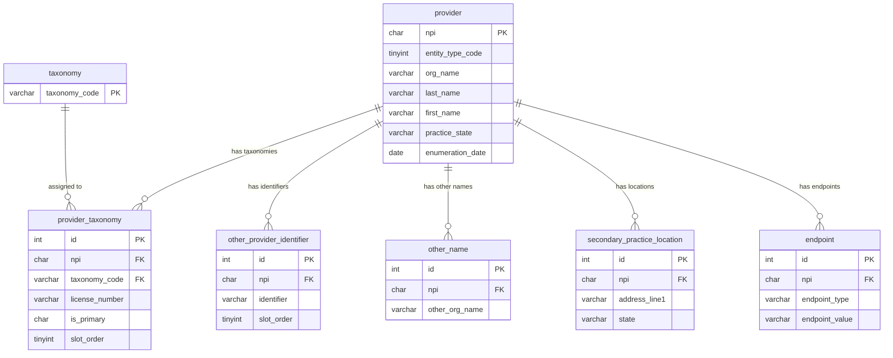

# NPI Relational Database (1NF)

A normalized relational database for **NPPES (National Plan and Provider Enumeration System)** data, designed for MariaDB. The schema is in **First Normal Form (1NF)** and is optimized for querying **NPI ↔ taxonomy** relationships.

---

## What This Project Does

1. **Normalizes** the flat NPPES dissemination CSV (330 columns, ~9.4M rows) into a proper relational schema.
2. **Eliminates repeating groups** by moving taxonomy codes (15 slots) and other provider identifiers (50 slots) into separate tables—one row per fact.
3. **Loads** the main NPI file plus three companion files (other names, practice locations, endpoints) via a Python ETL script.
4. **Exposes views** for common queries (e.g. primary taxonomy per NPI, NPI count per taxonomy code).

---

## Source Data

| File | Rows (approx) | Description |
|------|----------------|--------------|
| `npidata_pfile_20050523-20260208.csv` | 9.37 M | Core provider data + 15 taxonomy slots + 50 other-identifier slots |
| `othername_pfile_20050523-20260208.csv` | 709 K | Additional organization names |
| `pl_pfile_20050523-20260208.csv` | 1.15 M | Secondary practice location addresses |
| `endpoint_pfile_20050523-20260208.csv` | 593 K | Electronic endpoints (e.g. DIRECT) |

Data is from the [NPPES Data Dissemination](https://npiregistry.cms.hhs.gov/api-page) (May 2005 – Feb 2026). Bulk compressed dataset is downloaded from [here](https://download.cms.gov/nppes/NPI_Files.html).

---

## Relational Schema Diagram

All tables reference `provider(npi)` as the central entity. `provider_taxonomy` links NPIs to NUCC taxonomy codes and is the main table for **finding NPIs by taxonomy**.



A more detailed diagram with column lists is in **`schema_diagram.mmd`** (open in VS Code with a Mermaid extension or paste into [mermaid.live](https://mermaid.live)).

---

## Schema Summary (1NF)

| Table | Primary key | Purpose |
|-------|-------------|--------|
| **provider** | `npi` | One row per NPI; all scalar attributes (name, addresses, dates, authorized official, etc.). |
| **taxonomy** | `taxonomy_code` | Lookup of NUCC Healthcare Provider Taxonomy codes. |
| **provider_taxonomy** | `id` | One row per (NPI, taxonomy slot). **Core table for NPI ↔ taxonomy.** Includes license number, state, primary flag, taxonomy group. |
| **other_provider_identifier** | `id` | One row per (NPI, identifier slot). Other IDs (e.g. payer, state). |
| **other_name** | `id` | Additional organization names (companion file). |
| **secondary_practice_location** | `id` | Additional practice addresses (companion file). |
| **endpoint** | `id` | Electronic endpoints (companion file). |

**Views**

- **`v_npi_primary_taxonomy`** — Provider name, primary taxonomy code, license, state, practice location.
- **`v_taxonomy_npi_count`** — Per taxonomy code: total NPIs and count with that code as primary.

---

## 1NF Transformations Applied

- **Repeating group 1:** The 15 columns `Healthcare Provider Taxonomy Code_1` … `_15` (plus license number, state, primary switch, taxonomy group) were replaced by **`provider_taxonomy`** — one row per taxonomy assignment, with `slot_order` 1..15.
- **Repeating group 2:** The 50 columns `Other Provider Identifier_1` … `_50` (plus type, state, issuer) were replaced by **`other_provider_identifier`** — one row per identifier, with `slot_order` 1..50.
- Every column holds a single atomic value; every table has a defined primary key.
- **Dropped column:** `NPI Deactivation Reason Code` (blank in the entire dataset).

---

## Requirements

- **MariaDB** (latest stable)
- **Python 3.8+** with **PyMySQL**: `pip install PyMySQL`

---

## Setup and Load

1. **Create database and tables**

   ```bash
   mysql -u root -p < schema_1nf.sql
   ```

2. **Activate the environment and run the ETL** (from the project directory)

   ```bash
   source .conda/bin/activate
   pip install -r requirements.txt   # if not already installed

   export NPI_DB_HOST=localhost
   export NPI_DB_USER=root
   export NPI_DB_NAME=npi_db
   export NPI_DATA_DIR=/path/to/dir/with/csv/files   # default: ./ if not set
   # NPI_DB_PASSWORD: set via env, or leave unset to be prompted (3 retries on wrong password)

   python3 etl_load_1nf.py
   ```

   Optional: `NPI_BATCH_SIZE` (default 2000), `NPI_DB_PORT` (default 3306).

   The script reads all four CSV files, fills `provider`, `taxonomy`, `provider_taxonomy`, `other_provider_identifier`, `other_name`, `secondary_practice_location`, and `endpoint`. Re-running is safe (uses `INSERT IGNORE` where appropriate).

---

## Example Queries (NPI ↔ Taxonomy)

**NPIs with a given primary taxonomy code (e.g. 207X00000X):**

```sql
SELECT npi, provider_name, taxonomy_code, license_state_code, practice_state, practice_city
FROM v_npi_primary_taxonomy
WHERE taxonomy_code = '207X00000X'
LIMIT 20;
```

**All taxonomies for one NPI:**

```sql
SELECT pt.taxonomy_code, pt.is_primary, pt.license_number, pt.license_state_code, pt.taxonomy_group
FROM provider_taxonomy pt
WHERE pt.npi = '1679576722'
ORDER BY pt.slot_order;
```

**Top taxonomy codes by NPI count:**

```sql
SELECT taxonomy_code, total_npis, primary_count
FROM v_taxonomy_npi_count
ORDER BY total_npis DESC
LIMIT 20;
```

---

## Project Files

| File | Description |
|------|-------------|
| `schema_1nf.sql` | MariaDB DDL: database, tables, indexes, FKs, views. |
| `schema_diagram.mmd` | Mermaid ER diagram (tables and relationships). |
| `etl_load_1nf.py` | Python ETL: CSV → MariaDB load for all four files. |
| `README.md` | This file. |

---

## License and Data

NPPES data is subject to CMS/NPPES terms of use. This project’s schema and ETL are provided as-is for loading and querying that data in a normalized relational form.
